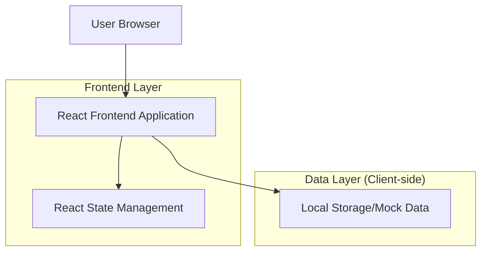
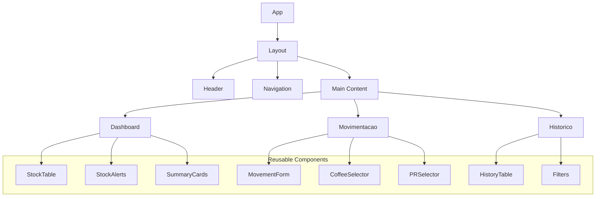

## 1. Architecture design



## 2. Technology Description

* **Frontend**: React\@18 + Vite + TypeScript

* **Estilização**: Tailwind CSS + Styled Components

* **Gerenciamento de Estado**: React Context API + useReducer

* **Formulários**: React Hook Form + Yup para validação

* **Tabelas**: TanStack Table (React Table) para funcionalidades avançadas

* **Gráficos**: Chart.js para visualizações de estoque

* **Testes**: Jest + React Testing Library

* **Build Tool**: Vite (mais rápido que Create React App)

* **Linting**: ESLint + Prettier

### Por que React + Vite?

* **Performance**: Vite oferece HMR (Hot Module Replacement) extremamente rápido

* **Bundle Size**: Menor que CRA, melhor para aplicações que podem rodar offline

* **TypeScript**: Suporte nativo para melhor desenvolvimento e manutenção

* **Componentes Reutilizáveis**: Facilita manutenção e escalabilidade

## 3. Route definitions

| Route          | Purpose                                        |
| -------------- | ---------------------------------------------- |
| /              | Dashboard principal com visão geral do estoque |
| /movimentacao  | Página de registro de entradas/saídas          |
| /historico     | Página de histórico completo de movimentações  |
| /relatorios    | Página de relatórios e gráficos (futuro)       |
| /configuracoes | Configurações do sistema (futuro)              |

## 4. Component Architecture



## 5. Data Model (Mock Data)

### 5.1 Types TypeScript

```typescript
interface Coffee {
  id: string;
  name: string;
  roasts: Roast[];
  observations?: string;
}

interface Roast {
  id: string;
  date: string;
  pr: string;
  quantity: number; // in grams
}

interface Movement {
  id: string;
  timestamp: string;
  type: 'entrada' | 'saida';
  coffeeId: string;
  coffeeName: string;
  pr: string;
  quantity: number;
  observations?: string;
}

interface StockAlert {
  coffeeId: string;
  coffeeName: string;
  currentQuantity: number;
  threshold: number;
}
```

### 5.2 Mock Data Structure

```typescript
// Initial mock data
const mockCoffees: Coffee[] = [
  {
    id: '1',
    name: 'BLENDA DA CASA',
    roasts: [{ id: '1', date: '-', pr: 'X', quantity: 0 }],
    observations: ''
  },
  {
    id: '2',
    name: 'GABRIEL',
    roasts: [{ id: '2', date: '22/01/26', pr: '9166', quantity: 540 }],
    observations: ''
  }
  // ... more coffees
];

const mockMovements: Movement[] = [];
```

## 6. State Management

### 6.1 Context Structure

```typescript
interface AppState {
  coffees: Coffee[];
  movements: Movement[];
  alerts: StockAlert[];
  lastUpdate: Date;
}

interface AppContextType {
  state: AppState;
  actions: {
    addMovement: (movement: Omit<Movement, 'id' | 'timestamp'>) => void;
    updateCoffee: (coffeeId: string, updates: Partial<Coffee>) => void;
    refreshData: () => void;
  };
}
```

### 6.2 Local Storage Strategy

* Persistir dados no localStorage para manter estado entre sessões

* Implementar backup automático a cada mudança significativa

* Exportação/importação de dados em JSON para segurança

## 7. Performance Optimizations

### 7.1 React Optimizations

* **React.memo** para componentes de tabela pesados

* **useMemo** para cálculos complexos de estoque

* **useCallback** para funções de handlers

* **Virtual scrolling** para tabelas com muitos dados

### 7.2 Bundle Optimizations

* Code splitting por rotas

* Lazy loading de componentes pesados

* Tree shaking para remover código não utilizado

## 8. Development Setup

```bash
# Create project
npm create vite@latest sistema-estoque-torrefacao --template react-ts

# Install dependencies
npm install react-router-dom @tanstack/react-table react-hook-form yup
npm install -D tailwindcss postcss autoprefixer @types/react @types/react-dom

# Initialize Tailwind
npx tailwindcss init -p
```

## 9. Testing Strategy

### 9.1 Unit Tests

* Componentes React com React Testing Library

* Funções de utilidade e helpers

* Validações de formulário

### 9.2 Integration Tests

* Fluxo completo de registro de movimentação

* Cálculos de estoque

* Persistência de dados

## 10. Future Considerations

### 10.1 Backend Migration (Quando necessário)

* **Backend**: Node.js + Express + Supabase

* **Authentication**: Supabase Auth

* **Database**: PostgreSQL via Supabase

* **Real-time**: Supabase Real-time para atualizações instantâneas

### 10.2 Features Futuras

* Sistema de login multiusuário

* Relatórios detalhados com gráficos

* Alertas automáticos por email

* Integração com sistemas de venda

* App mobile com React Native

