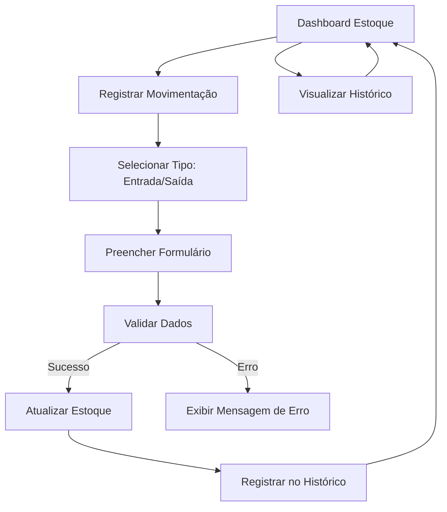

## 1. Product Overview
Sistema de gestão de estoque para torrefação de café, permitindo controle de lotes (PR), registro de entradas/saídas e acompanhamento em tempo real do estoque de grãos torrados.

O sistema visa resolver o problema de controle manual de estoque em torrefações pequenas/médias, oferecendo uma interface simples e eficiente para gerenciar diferentes tipos de café e suas respectivas torras.

## 2. Core Features

### 2.1 User Roles
| Role | Registration Method | Core Permissions |
|------|---------------------|------------------|
| Administrador | Login único via sistema | Controle total: visualizar, adicionar, editar, remover estoque e acessar histórico |
| Operador | Login básico | Registrar entradas/saídas, visualizar estoque atual |

### 2.2 Feature Module
O sistema de estoque consiste nas seguintes páginas principais:
1. **Dashboard de Estoque**: visualização completa do estoque atual com alertas de baixa quantidade
2. **Registro de Movimentação**: formulário para registrar entradas e saídas de café
3. **Histórico**: registro completo de todas as movimentações realizadas

### 2.3 Page Details
| Page Name | Module Name | Feature description |
|-----------|-------------|---------------------|
| Dashboard de Estoque | Tabela de Estoque | Exibir lista de cafés com PR, data de torra, quantidades individuais e total por tipo |
| Dashboard de Estoque | Alertas de Estoque | Identificar visualmente cafés com menos de 500g através de cores e badges |
| Dashboard de Estoque | Atualização em Tempo Real | Mostrar timestamp da última atualização do estoque |
| Registro de Movimentação | Tipo de Movimentação | Selecionar entre entrada (➕) ou saída (➖) de estoque |
| Registro de Movimentação | Seleção de Café | Dropdown com lista de cafés disponíveis no estoque |
| Registro de Movimentação | Seleção de PR/Lote | Mostrar PRs existentes ou permitir digitar novo PR |
| Registro de Movimentação | Data de Torra | Input de data para registro da torra |
| Registro de Movimentação | Quantidade | Input numérico para quantidade em gramas |
| Registro de Movimentação | Observações | Campo de texto opcional para anotações |
| Registro de Movimentação | Validações | Verificar quantidade disponível antes de permitir saída |
| Registro de Movimentação | Mensagens de Feedback | Exibir sucesso ou erro após submissão do formulário |
| Histórico | Tabela de Histórico | Listar todas as movimentações com data, tipo, café, PR, quantidade e observações |
| Histórico | Ordenação | Exibir histórico em ordem decrescente por data/hora |
| Navegação | Abas de Navegação | Alternar entre Dashboard, Registro e Histórico com interface em abas |

## 3. Core Process
O fluxo principal do sistema permite que o usuário:
1. Visualize o estoque atual na dashboard principal
2. Identifique cafés com estoque baixo através de alertas visuais
3. Registre novas entradas de café selecionando o tipo, PR, data e quantidade
4. Registre saídas de café com validação de disponibilidade
5. Acompanhe o histórico completo de todas as movimentações

## 4. User Interface Design

### 4.1 Design Style
- **Cores Primárias**: Gradiente roxo (#667eea para #764ba2) no background
- **Cores Secundárias**: Branco para cards e conteúdo, vermelho (#ff6b6b) para alertas
- **Botões**: Estilo arredondado com hover effects e sombras
- **Fontes**: Segoe UI, Tahoma, Geneva, Verdana, sans-serif
- **Layout**: Card-based com sombras e bordas arredondadas
- **Ícones**: Emojis nativos para representar ações (📦, ➕, ➖, 📋)

### 4.2 Page Design Overview
| Page Name | Module Name | UI Elements |
|-----------|-------------|-------------|
| Dashboard | Header | Título com emoji de café (☕), timestamp com ícone de gráfico (📊) |
| Dashboard | Tabela | Cabeçalho roxo com texto branco, linhas alternadas com hover effect, cores de alerta para estoque baixo |
| Registro | Formulário | Inputs com bordas arredondadas, foco com borda roxa, botões primários com gradiente |
| Registro | Radio Buttons | Agrupados horizontalmente com emojis para entrada/saída |
| Histórico | Tabela | Fonte menor (14px), cores verde/vermelha para entrada/saída |

### 4.3 Responsiveness
- Design desktop-first com adaptação para tablets
- Layout fluido com max-width de 1400px
- Cards e tabelas responsivas
- Touch-friendly para uso em tablets industriais

### 4.4 Interações e Animações
- Hover effects em botões e elementos clicáveis
- Transições suaves nas abas de navegação
- Feedback visual imediato após ações do usuário
- Auto-scroll para mensagens de sucesso/erro